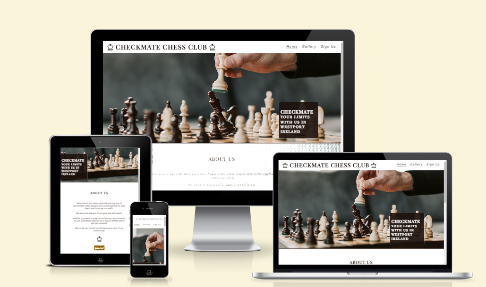

#  Checkmate Chess Club 
### A website built for a fictional Chess Club in Westport,Ireland
## Project 1 - Tomas Karavasilev

## *[Live site](https://karoskodev.github.io/chess-club/)*
## *[Repository](https://github.com/Karoskodev/chess-club)*

## contents

1. [ UX ](#ux)
2. [ Features ](#features)  
3. [ Technology used ](#tech)
4. [ Testing ](#testing)
5. [ Deployment](#deployment)
6. [ Credits](#credits)
7. [ Acknowledgements](#acknowledgements)

 

## UX
### Site Goals
The goal of this website is to provide information about our chess club to both current members and potential new members.Promote interest in the game of chess and encourage new members to join.
### User Stories

 #### As a user:
 - As a chess enthusiast, I want to learn more about the club's activities and events so that I can participate in them.
 - As a potential new member, I want to easily find information about how to join the club
 - As a current member, I want to stay up-to-date with events.

 #### As the site owner:
 -  I want to create a user-friendly and informative website that accurately reflects the mission and values of our club.
 - I want to promote interest in the game of chess and encourage new members to join our club.
 - I want to gather users emails to send them my weekly chessletter

### Wireframes
 
 #### Home Page Wireframe
  

 #### Gallery Wireframe
  

 #### Sign up form page
  