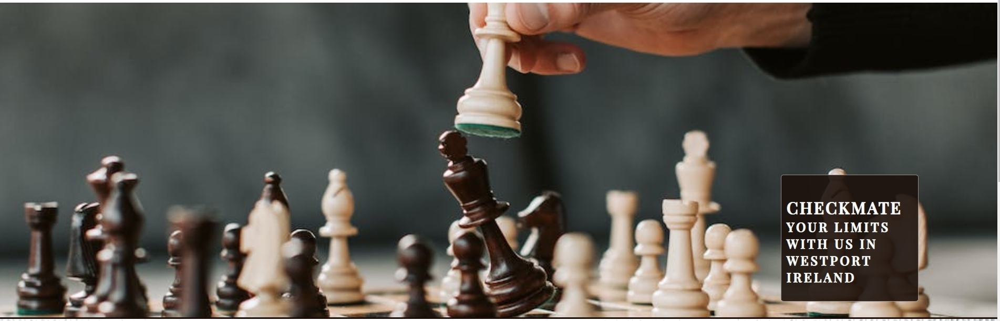
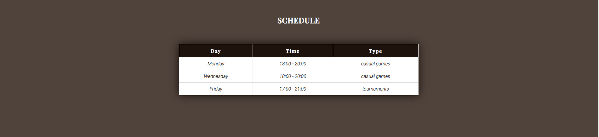
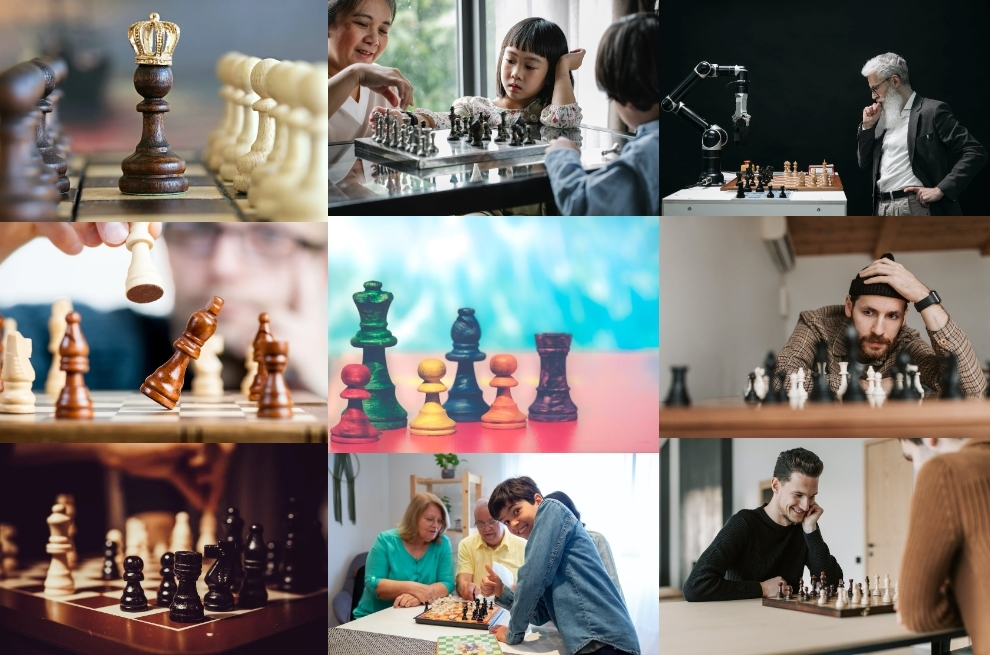

#  Checkmate Chess Club 
### A website built for a fictional Chess Club in Westport,Ireland
## Project 1 - Tomas Karavasilev

## *[Live site](https://karoskodev.github.io/chess-club/)*
## *[Repository](https://github.com/Karoskodev/chess-club)*

## contents

1. [ UX ](#ux)
2. [ Features ](#features)  
3. [ Technology used ](#tech)
4. [ Testing ](#testing)
5. [ Deployment](#deployment)
6. [ Credits](#credits)
7. [ Acknowledgements](#acknowledgements)

 

## UX
### Site Goals
The goal of this website is to provide information about our chess club to both current members and potential new members.Promote interest in the game of chess and encourage new members to join.
### User Stories

 #### As a user:
 - As a chess enthusiast, I want to learn more about the club's activities and events so that I can participate in them.
 - As a potential new member, I want to easily find information about how to join the club
 - As a current member, I want to stay up-to-date with events.

 #### As the site owner:
 -  I want to create a user-friendly and informative website that accurately reflects the mission and values of our club.
 - I want to promote interest in the game of chess and encourage new members to join our club.
 - I want to gather users emails to send them my weekly chessletter

### Wireframes
 
 #### Home Page Wireframe
  

 #### Gallery Wireframe
  

 #### Sign up form page
  

## Features
 ### Logo and Navigation Bar
  The Heading section of the webpage includes a Logo that can be clicked on to take the user to the Home page of the website. The Heading section also contains a Navigation Bar that has three links: Home, Gallery, Sign Up. 
  

 ### Hero Image section
   Image with a box overlay, which is used to display location and motto.
   

 ### About us section
  This section provides a information about chess club,it also include a call-to-action button that directs users to a sign-up form page.
  

  ### Schedule section
   This section on the webpage includes a table that displays information about the time and type of meetings or events.
  

  ### Footer
   Contains links to social media sites.
   

   
  ### Gallery
   Gallery of images that is organized into 3 columns and 3 rows.
   

  ### Sign Up Form
   This section contains a form with two inputs for text and one for email  and also contains a button to submit the form.
   

## Technology Used
 ### Html
> Used to structure my webpages

 ### CSS
> Used to style and add structure to my site

 ### Font Awesome
> Used for all the icons

 ### GoogleFonts
> Used for fonts in this project